# char_gen
A python script to generate D&amp;D characters

---
abstract: |
  Role-playing games like Dungeons & Dragons empower players to create
  diverse in-game personalities, known as player characters (PCs),
  through a complex system of choices. A wide range of choices is
  available for creating a PC, with combinations of these choices
  leading to diverse personalities and abilities to explore. This study
  simulates the population of adventurers based on the Player's Handbook
  (PHB) to explore demographic trends and answer the question, "How
  common is my character?"
author:
- Simon-Hans Edasi
title: |
  Demographics of Adventurers in the 2014\
  Dungeons & Dragons 5th Edition Player's Handbook--\
  A Statistical Simulation of a Creative Environment\
  (Draft)
---

# Introduction

Originally published in 1974, Dungeons & Dragons has grown into a
cultural phenomenon, experiencing a major resurgence following the 2014
release of its 5th edition (5e). Accompanying this edition were the
Dungeon Master's Guide (DMG), Monster Manual (MM), and Player's Handbook
(PHB), as well as two adventure paths and a starter adventure. Among
these, the PHB stands out as the essential resource for creating a
first-level character and diving into the game. It guides players
through crafting their characters, offering detailed instructions on
selecting attributes, backgrounds, and abilities.\
Role-playing games like Dungeons & Dragons immerse players in
collaborative storytelling, where they adopt the roles of
player-characters (PCs) to explore worlds crafted by the Dungeon Master
(DM). A PC's abilities and traits are built using six core attributes
that define their physical and mental strengths: Strength, Dexterity,
Constitution, Intelligence, Wisdom, and Charisma. These scores govern a
character's interaction with the game world, from catching a thrown
tomato (Dexterity) to persuading someone to buy it (Charisma). Skills
linked to these attributes, along with proficiencies granted by a
character's class and background, further shape how a character
navigates challenges and opportunities.\
The richly imagined world of Faerûn, the primary setting of D&D 5e, is
home to an array of fantastical species. Humans coexist with Elves,
Dwarves, Gnomes, and more, while darker influences give rise to
Tieflings, Dragonborn, and Half-Orcs. Each species offers unique bonuses
to attributes and abilities, such as enhanced vision in darkness or
communicating with small animals. Building on these traits, players
select a character class---like Fighter, Wizard, or Rogue---which
defines a character's role and specialties in combat and storytelling.
Backgrounds further flesh out a character's history, granting additional
proficiencies and personality traits that enrich role-playing.\
While creating a character is an exciting process, it raises a common
question for players and DMs: How common is this character?
Understanding a character's origins and traits within the context of the
world adds depth to storytelling and can inspire richer gameplay. By
analyzing the demographics of adventurers in Faerûn, this study aims to
uncover patterns in character creation, offering insights that enhance
the world-building and narrative experience for players and DMs alike.

# Methods

This study uses Python to simulate the generation of viable level-1
characters in Dungeons & Dragons 5e, employing random number generators
and SQL tables to store and retrieve species, class, and background
data. The simulation utilizes a while-loop to re-roll attribute arrays
until all selection criteria are met. For a character to be considered
viable, they must meet the following conditions:

-   At least one attribute score of 16 or higher.

-   An average attribute score of 12 or higher.

-   Species, class, and background selections are made.

The process generates 10,000 characters per simulation to model the
adventuring population. The experiment is repeated 50 times to establish
confidence intervals for the observed distributions. Contingency tables
of species/class, species/background, and class/background combinations
are analyzed using a $\chi^{2}$ test, and the results are compared to a
governing matrix of class attributes to derive insights into selection
mechanics.

## Attributes

Attribute scores are determined with random number generators "rolling"
four six-sided dice (4d6) and summing the three highest rolls. Scores
are assigned in order to Strength, Dexterity, Constitution,
Intelligence, Wisdom, and Charisma. If no score is 16 or higher or the
average score is below 12, the character \"dies of farming,\" and the
process restarts. The number of failures (or \"dead farmers\") is
tracked to inform alignment selection later.

## Species Selection

Once a viable attribute array is generated, the character's species is
determined. Attribute scores are grouped into lowest two,
highest/lowest, and highest two categories, with consideration for ties.
Species that grant bonuses matching these groupings are added to a
selection list with ascending priority weights:

-   Lowest two attributes: Weight 0.

-   Middle two attributes: Weight 1.

-   Highest two attributes: Weight 2.

For example, if Wisdom and Dexterity are the lowest scores, Human,
Half-Elf, and Forest-Gnome (species with matching bonuses) are added to
the list with weight 0. If Constitution and Intelligence are the middle
scores, Human and Half-Elf are added with weight 1. For highest scores,
Strength and Charisma, Human and Dragonborn are added with weight 2.
Species abilities (e.g., darkvision, magic resistance) are assigned
subjective, tunable weights
(Sec [8.1](#species_feats){reference-type="ref"
reference="species_feats"}), further modifying the selection list.\
The final weighted list is used for species selection via a random
choice function. For example, if Human accumulates a total weight of 18,
Half-Elf 11, Dragonborn 17, and Forest-Gnome 22, these values determine
the probabilities of selection.

## Class Selection

After applying species attribute bonuses, the character's class is
selected. Classes prioritize attributes as indicated in the Player's
Handbook. The character's highest attribute, or tied highest attributes,
is designated as the primary attribute, while the second-highest (or
tied) is the secondary attribute.\
The simulation matches these attributes against class requirements in
the class data table. If multiple classes are viable, the class with the
highest frequency of matching combinations is selected. For example, an
array with tied primary attributes Strength (STR) and Intelligence (INT)
and secondary attributes Dexterity (DEX) and Constitution (CON) might
match Fighter (STR/CON), Fighter (STR/INT), and Wizard (INT/CON). Since
Fighter appears more frequently, it is selected.

## Background Selection

Backgrounds are chosen based on skill proficiencies tied to the
character's two highest attributes. Skills governed by these attributes
are added to a list, which is cross-referenced with the background data
table to find matching backgrounds. If multiple backgrounds are viable,
the selection is made randomly without weighting.

## Alignment Selection

Alignment selection begins with an initial weighting system that heavily
favors Good and Lawful alignments. Each time a character fails to meet
the generation criteria, this failure is recorded as a "dead farmer",
symbolizing deaths in the final character's life before adventuring.
These deaths influence the initial weights, gradually shifting the
alignment probabilities toward Evil and Chaotic alignments as follows:

-   Good alignments decrease by the total number of deaths.

-   Evil alignments increase by the total number of deaths.

-   Lawful alignments decrease at half the rate of Good alignments.

-   Chaotic alignments increase at half the rate as Evil alignments.

-   Neutral alignments decrease at a rate of
    $0.3 \times \text{Dead Farmers}$.

A random choice function applies the adjusted weights to select the
character's final alignment. This system ensures a dynamic relationship
between a character's background and their moral and ethical
disposition, grounded in the simulated events of their pre-adventuring
life.

# Results

The results of the character demographics simulation are presented
below. Species, class, background, and alignment distributions are
reported as mean counts, with confidence intervals derived from 50
simulations. These distributions reveal key trends in the selection of
character species, classes, and backgrounds, shedding light on the
underlying mechanics of character creation in Dungeons & Dragons 5e.\
Figures [\[combo_species_class\]](#combo_species_class){reference-type="ref"
reference="combo_species_class"}, [\[combo_species_background\]](#combo_species_background){reference-type="ref"
reference="combo_species_background"},
and [\[combo_class_background\]](#combo_class_background){reference-type="ref"
reference="combo_class_background"} illustrate the frequency of
different species/class/background combinations, ranked from most to
least selected. These combinations provide valuable insights into which
species and classes are most commonly paired together and how
backgrounds influence character selection.\
To assess the significance of these combinations, standardized
$\chi^{2}$ residuals are presented in
Figures [\[chisq-species_class\]](#chisq-species_class){reference-type="ref"
reference="chisq-species_class"}, [\[chisq-species_background\]](#chisq-species_background){reference-type="ref"
reference="chisq-species_background"},
and [\[chisq-class_background\]](#chisq-class_background){reference-type="ref"
reference="chisq-class_background"}. These figures highlight the
statistical significance of specific species/class pairings, taking into
account the overall distributions of both characters and classes within
the combinations. By examining these residuals, a better understanding
can be reached of which species and class combinations deviate from
expected frequencies, suggesting underlying patterns and preferences in
character creation.\

::: figure*
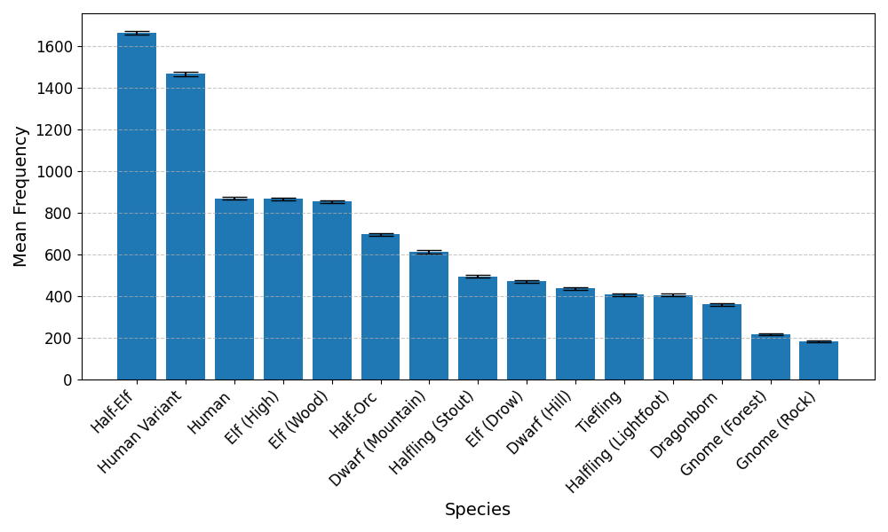{width="87.5%"}
:::

::: {#species_table}
  Species                  Mean Count      Percentage
  ---------------------- ------------ ---------------
  Half-Elf                   1663 ± 8   16.63 ± 0.08%
  Human Variant             1466 ± 11   14.66 ± 0.11%
  Human                       869 ± 8    8.69 ± 0.08%
  Elf (High)                  866 ± 7    8.66 ± 0.07%
  Elf (Wood)                  853 ± 7    8.53 ± 0.07%
  Half-Orc                    696 ± 7    6.96 ± 0.07%
  Dwarf (Mountain)            612 ± 7    6.12 ± 0.07%
  Halfling (Stout)            494 ± 6    4.94 ± 0.06%
  Elf (Drow)                  471 ± 7    4.71 ± 0.07%
  Dwarf (Hill)                437 ± 6    4.37 ± 0.06%
  Tiefling                    406 ± 5    4.06 ± 0.05%
  Halfling (Lightfoot)        406 ± 6    4.06 ± 0.06%
  Dragonborn                  360 ± 5    3.60 ± 0.05%
  Gnome (Forest)              218 ± 4    2.18 ± 0.04%
  Gnome (Rock)                184 ± 4    1.84 ± 0.04%

  : Mean counts and population percentage of generated adventurers.
:::

::: figure*
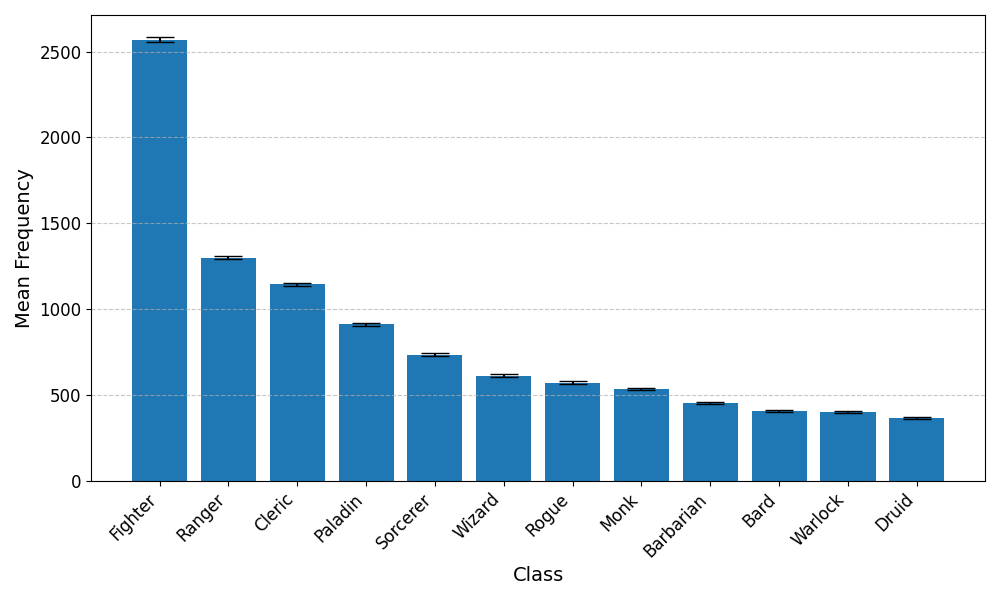{width="\\textwidth"}
:::

::: {#class_table}
  Class         Mean Count      Percentage
  ----------- ------------ ---------------
  Fighter        2570 ± 14   25.70 ± 0.14%
  Ranger          1298 ± 9   12.98 ± 0.09%
  Cleric          1143 ± 8   11.43 ± 0.08%
  Paladin          911 ± 8    9.11 ± 0.08%
  Sorcerer         735 ± 8    7.35 ± 0.08%
  Wizard           612 ± 7    6.12 ± 0.07%
  Rogue            571 ± 6    5.71 ± 0.06%
  Monk             535 ± 6    5.35 ± 0.06%
  Barbarian        452 ± 5    4.52 ± 0.05%
  Bard             407 ± 5    4.07 ± 0.05%
  Warlock          401 ± 5    4.01 ± 0.05%
  Druid            365 ± 5    3.65 ± 0.05%

  : Mean counts and population percentage of generated adventurers.
:::

::: figure*
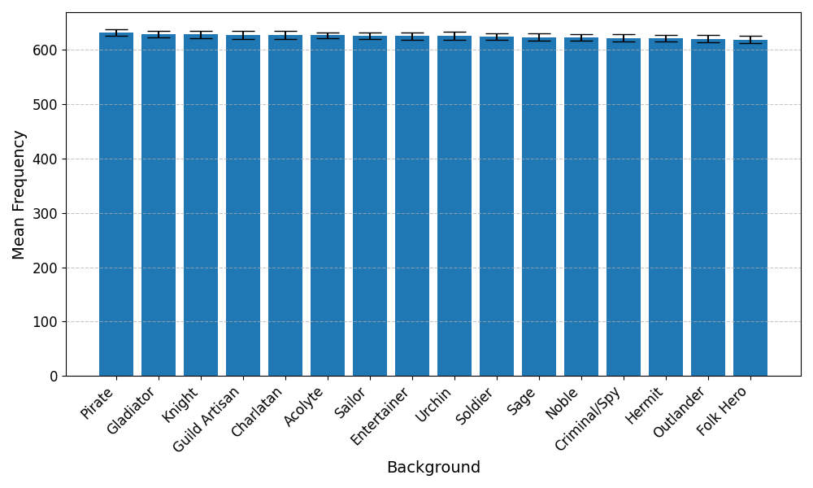{width=".8\\textwidth"}
:::

::: {#background_table}
  Background        Mean Count     Percentage
  --------------- ------------ --------------
  Pirate               631 ± 6   6.31 ± 0.06%
  Gladiator            629 ± 6   6.29 ± 0.06%
  Charlatan            628 ± 8   6.28 ± 0.08%
  Guild Artisan        628 ± 8   6.28 ± 0.08%
  Knight               628 ± 7   6.28 ± 0.07%
  Acolyte              627 ± 5   6.27 ± 0.05%
  Entertainer          626 ± 7   6.26 ± 0.07%
  Sailor               626 ± 6   6.26 ± 0.06%
  Urchin               625 ± 7   6.25 ± 0.07%
  Soldier              624 ± 6   6.24 ± 0.06%
  Sage                 623 ± 6   6.23 ± 0.06%
  Noble                623 ± 6   6.23 ± 0.06%
  Criminal/Spy         622 ± 7   6.22 ± 0.07%
  Hermit               621 ± 6   6.21 ± 0.06%
  Outlander            620 ± 7   6.20 ± 0.07%
  Folk Hero            619 ± 7   6.19 ± 0.07%

  : Mean counts and population percentage of generated adventurers.
:::

::: figure*
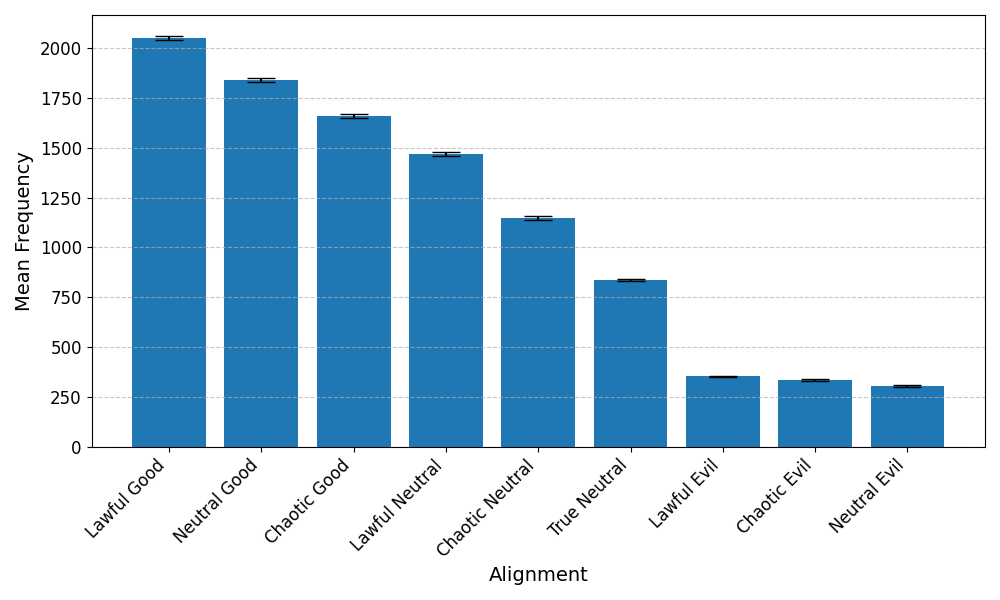{width="\\textwidth"}
:::

::: {#alignment_table}
  Alignment           Mean Count      Percentage
  ----------------- ------------ ---------------
  Lawful Good          2052 ± 12   20.52 ± 0.12%
  Neutral Good         1842 ± 10   18.42 ± 0.10%
  Chaotic Good         1659 ± 12   16.59 ± 0.12%
  Lawful Neutral       1470 ± 10   14.70 ± 0.10%
  Chaotic Neutral      1149 ± 10   11.49 ± 0.10%
  True Neutral           837 ± 6    8.37 ± 0.06%
  Lawful Evil            352 ± 4    3.52 ± 0.04%
  Chaotic Evil           335 ± 6    3.35 ± 0.06%
  Neutral Evil           304 ± 5    3.04 ± 0.05%

  : Mean counts and population percentage of generated adventurers.
:::

::: figure*
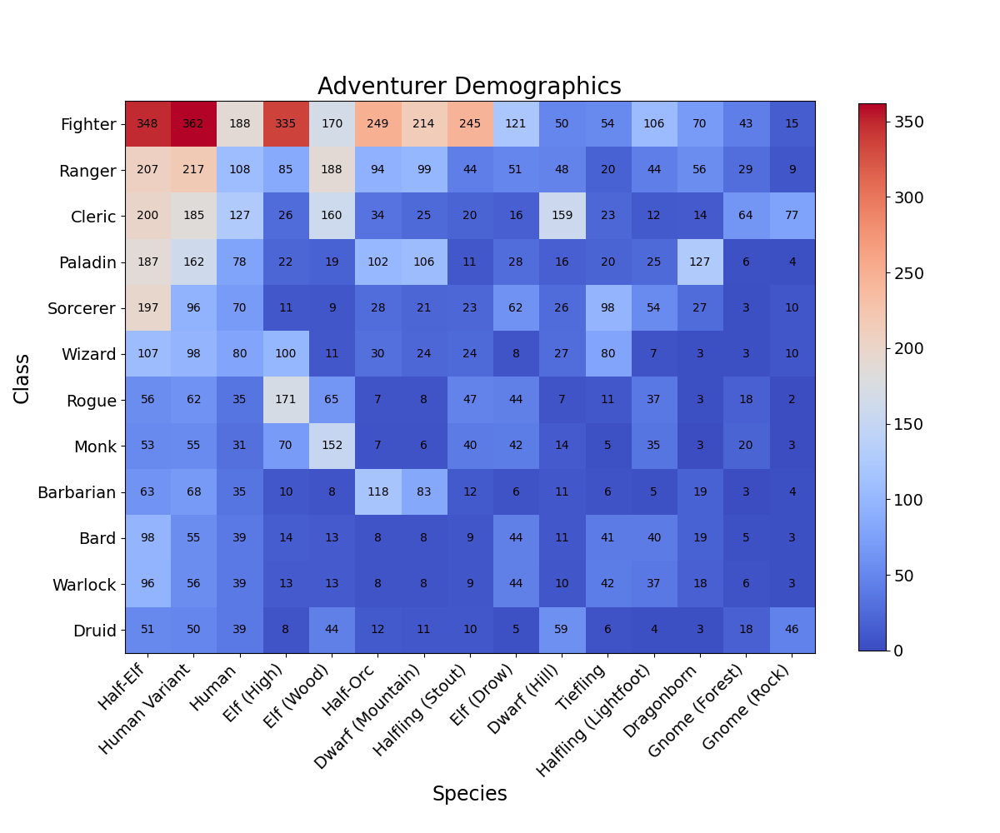{width=".7\\textwidth"}
:::

::: figure*
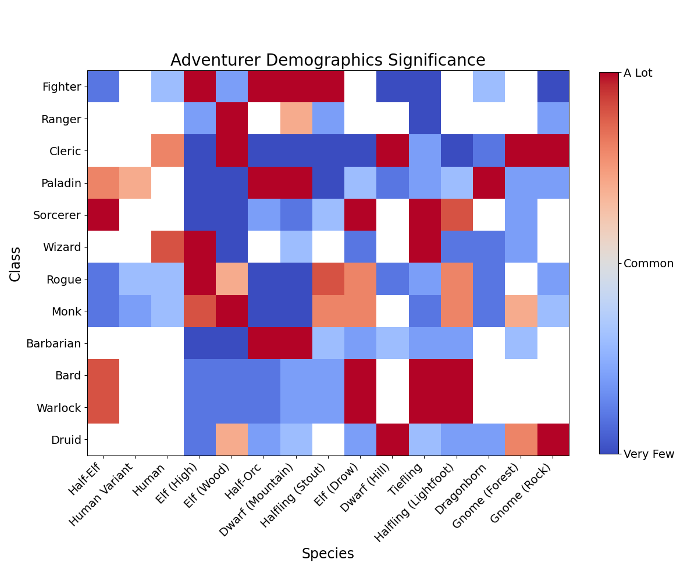{width=".7\\textwidth"}
:::

::: figure*
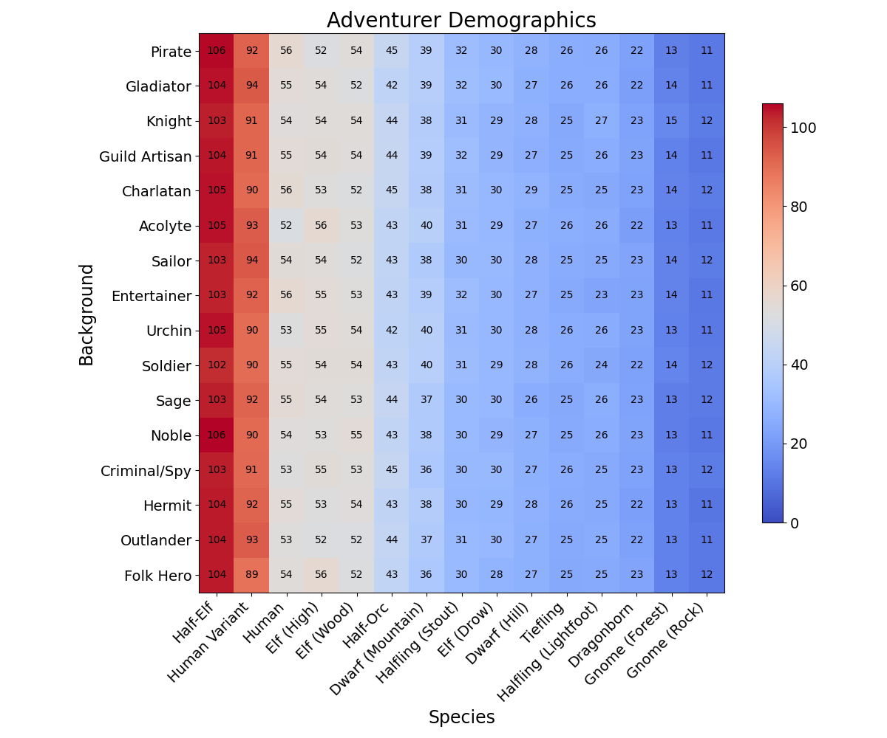{width=".7\\textwidth"}
:::

::: figure*
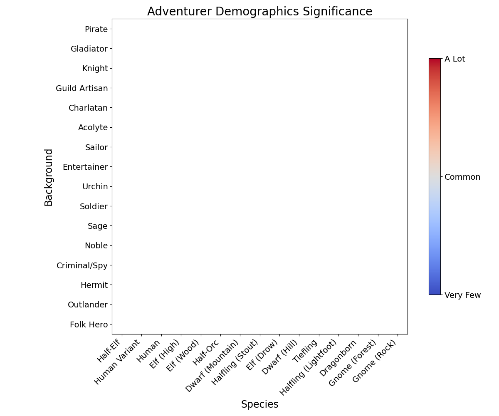{width=".7\\textwidth"}
:::

::: figure*
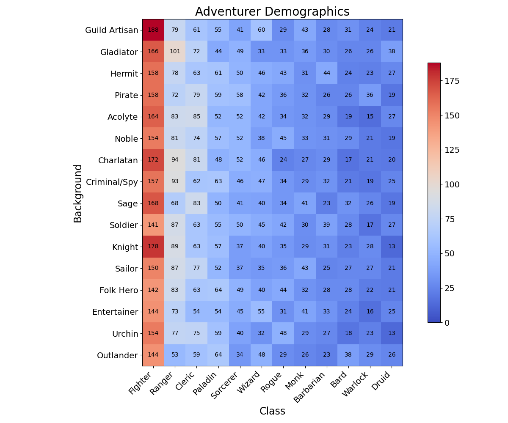{width=".7\\textwidth"}
:::

::: figure*
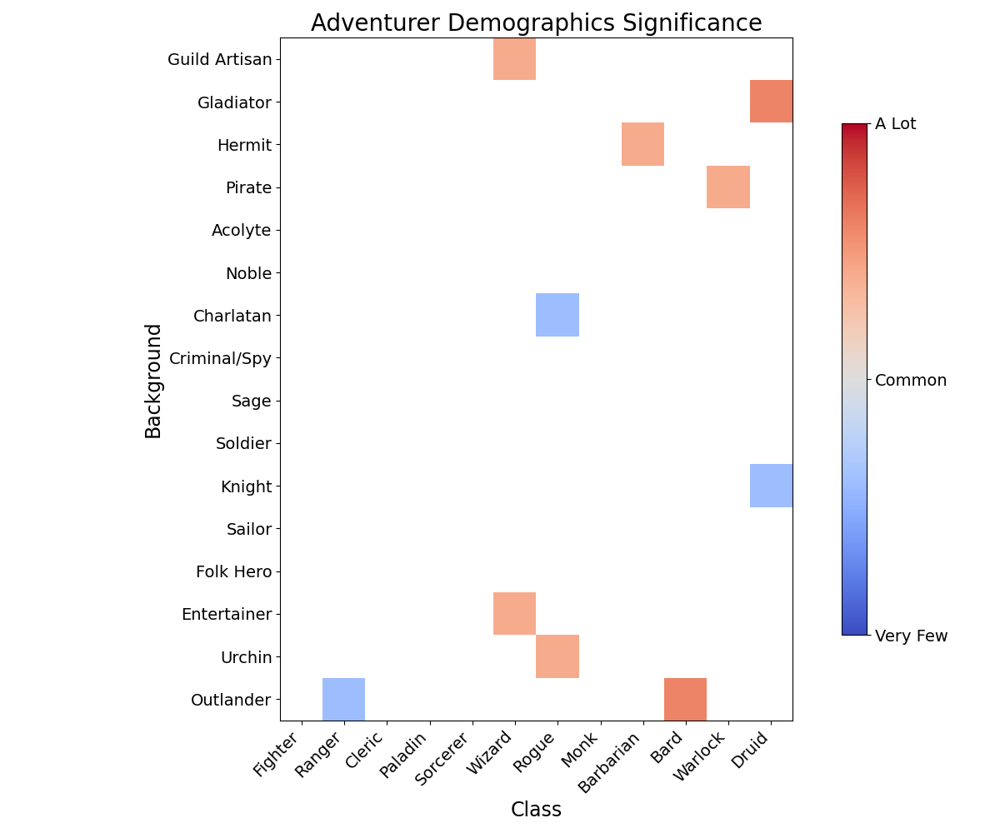{width=".7\\textwidth"}
:::

# Discussion

## Attributes

Figure [\[attribute_correlation\]](#attribute_correlation){reference-type="ref"
reference="attribute_correlation"} presents a correlation matrix for the
attribute arrays of 10,000 successfully generated characters. The
attributes---Strength, Dexterity, Constitution, Intelligence, Wisdom,
and Charisma---are generated in a fixed order, with each attribute
having a range of values between 3 and 18, derived from 3 of 4 six-sided
dice. The simulation enforces two key constraints: at least one
attribute must be 16 or greater, and the average of all attributes must
be at least 12. Notably, Strength and Dexterity exhibit a moderate
negative correlation, while the mental attributes---Intelligence,
Wisdom, and Charisma---are weakly negatively correlated. These
correlations deviate from what would be expected under complete
independence, which can be attributed to several interrelated factors:

1.  **Sequential Dependency**\
    Attributes are generated in a specific order. The likelihood of
    rolling a low score later in the array changes depending on the
    outcome of the physical attribute scores. A higher Strength or
    Dexterity score allows more wiggle room for lower mental attribute
    scores.

2.  **Character Mechanics Bias**\
    These correlations are calculated on completed attribute arrays,
    *after* species bonuses are applied. Species generally receive a
    major bonus to a physical attribute, Strength or Dexterity, and
    selection for species is partially weighted by the highest
    attributes. If, for instance, Strength is higher than Dexterity,
    picking a species to boost Strength will increase the difference
    between the attribute scores. Repeated a few thousand times, the
    attributes can appear negatively correlated.

3.  **Nonlinear Effects of Extreme Values:**\
    The rarity of extreme values (high or low scores) in the attribute
    distributions contributes to the observed correlations. Since the
    generation process uses 3 of 4 6-sided dice, middle-range values are
    far more common than extremes, creating a natural clustering around
    the average score. When constraints like requiring a
    $\geq$`<!-- -->`{=html}16 attribute are applied, it
    disproportionately affects the remaining attributes, as extreme
    values in one attribute become inversely related to the probability
    of similar extremes elsewhere. This effect amplifies negative
    correlations, especially between attributes with competing roles
    (e.g., Strength and Dexterity, or Intelligence and Charisma).

These factors, in combination, likely account for the deviations from
pure independence observed in the attribute correlation matrix.
Together, they reflect the interplay between random generation rules,
constraints, and post-processing biases inherent in the character
creation system.

::: figure*
{width="53.4%"}
:::

## Species

Figure [\[species\]](#species){reference-type="ref" reference="species"}
illustrates the distribution of species selections within the
experiment. Humans dominate the adventuring population, representing
approximately 23%, closely followed by Elves at 22%. Half-Elves account
for 16% of the population, with Dwarves comprising 10.5%, Halflings 9%,
and Half-Orcs 7%. Tieflings and Gnomes each represent 4%, while
Dragonborn are the least selected species at around 3.5%.\
The high frequency of Human and Half-Elf selections can be attributed to
their flexibility within the simulation. Since Humans and Half-Elves can
assign bonuses to any two attributes, they are more likely to produce
viable attribute arrays across multiple species-class combinations. This
flexibility results in higher selection rates, as their species bonuses
can match the highest or lowest attributes rolled in many character
arrays. This advantage is reflected in the weighted selection process,
where Humans and Half-Elves receive additional selection \"weight.\"\
Elves, particularly High Elves, are also highly represented due to their
bonuses to Dexterity and a mental attribute (often Intelligence). This
synergy aligns well with several classes, including Fighters and Rogues
(Fig [\[favored_attributes\]](#favored_attributes){reference-type="ref"
reference="favored_attributes"}). Conversely, Drow, who have a bonus to
Charisma and Dexterity, are less selected due to their sensitivity to
sunlight and their alignment with less commonly selected classes.\
Species choices also align closely with class preferences. For instance,
Dragonborn's bonuses to Strength and Charisma make them ideal candidates
for Paladins, resulting in their over-representation in that class.
Similarly, Dwarves and Half-Orcs are naturally inclined toward Barbarian
classes, as their bonuses are well-suited for this role. In contrast,
species like Gnomes and Tiefliengs are less selected due to their
attribute bonuses, which do not always optimize class selection,
particularly for physical classes.\
Interestingly, the selection of backgrounds
(Fig [\[chisq-species_background\]](#chisq-species_background){reference-type="ref"
reference="chisq-species_background"}) is evenly distributed across
species, suggesting a balanced and flexible world where all species have
access to a wide range of professions. This further emphasizes the
diverse and inclusive nature of the character generation mechanics in
Dungeons & Dragons.

::: figure*
{width=".6\\textwidth"}
:::

## Classes

Figure [\[class\]](#class){reference-type="ref" reference="class"} shows
that Fighter is the most selected class, likely due to the broad range
of attribute combinations available to create a Fighter, as outlined in
the Player's Handbook (PHB). Following Fighters, Rangers and Clerics are
the next most popular classes, driven by their flexibility in secondary
attributes
(Fig [\[class_attributes\]](#class_attributes){reference-type="ref"
reference="class_attributes"}). Paladins are ranked fourth, a result
that can be attributed to their specific attribute requirements
(Strength and Charisma). Dragonborn, whose bonuses align perfectly with
these requirements, are over-represented in the Paladin class, further
emphasizing the importance of species-class synergy.\
An examination of the preferred attribute combinations for each class
(Fig [\[class_attributes\]](#class_attributes){reference-type="ref"
reference="class_attributes"}) reveals that 12 unique combinations of
primary and secondary attributes are used to form classes, with five
combinations shared across multiple classes. This leaves 18 unused
attribute combinations, indicating that some attribute combinations
remain unexplored within the current class structure. These unused
combinations may present opportunities for future class expansions or
rebalancing of existing classes.\

::: figure*
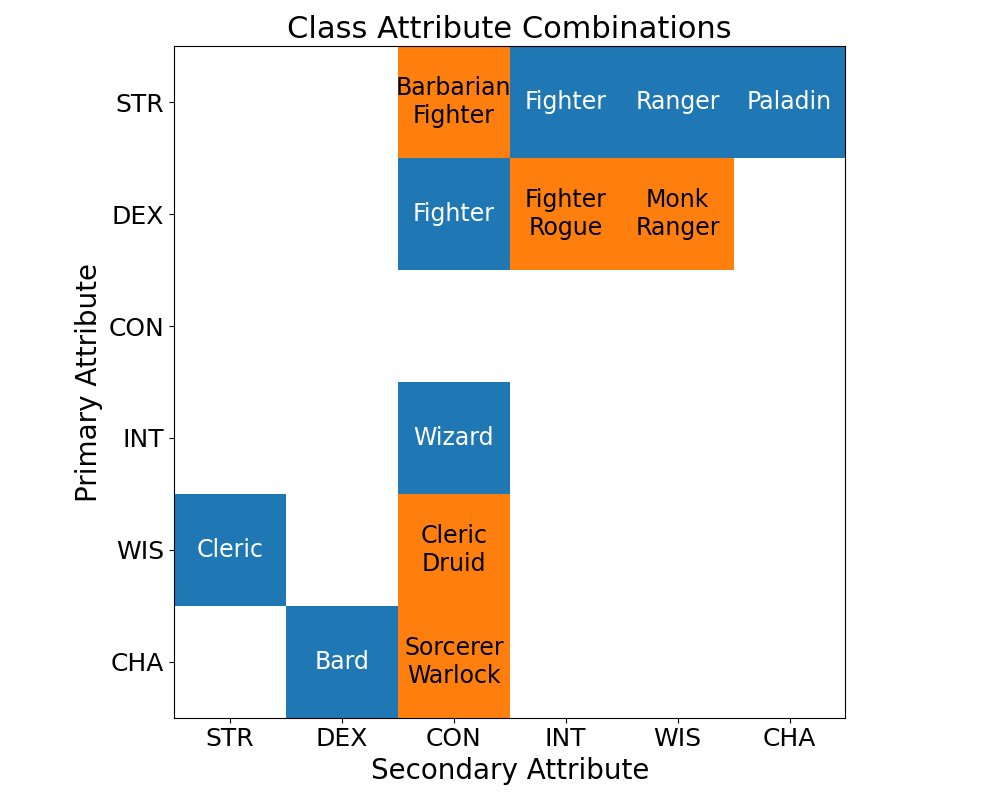{width=".6\\textwidth"}
:::

### Class Uniqueness Calculation

Class uniqueness was assessed by calculating the uniqueness of each
class's primary and secondary attributes. The uniqueness score $U$ was
calculated using the formula: $$U = \frac{1}{1+A},$$ where $A$
represents the number of other classes sharing the same attribute
combination. This score measures the distinctiveness of each class's
attribute combination, with a higher $U$ indicating a more unique build.
Additionally, combined uniqueness scores ($CU$) were computed to account
for both primary and secondary attribute overlaps:\
$$CU = \frac{1}{1 + PA + SA},$$ where $PA$ is the number of classes
sharing the primary attribute, and $SA$ is the number of classes sharing
the secondary attribute. This combined score provides a comprehensive
measure of how distinct each class's attribute requirements are compared
to those of other classes.

### Results of Class Uniqueness

-   Fighter emerged as the least unique class, as Fighters share their
    primary and secondary attributes with several other classes,
    including Barbarians and Paladins. The Fighter's attribute
    flexibility enables a variety of builds, but this overlap results in
    a low uniqueness score.

-   Bard exhibited the highest uniqueness score, as no other class uses
    Dexterity as a secondary attribute. This attribute combination makes
    Bard a highly distinct option for character creation.

-   Clerics demonstrate a unique attribute combination by being the only
    class to use Strength as a secondary attribute. However, Clerics
    score lower in uniqueness due to sharing Wisdom as their primary
    attribute with multiple other classes.

-   Monks and Rogues have similar uniqueness scores, reflecting the
    overlap in their preferred primary attribute (Dexterity), though
    their secondary attributes differ. Despite this, their overall
    uniqueness scores remain similar, likely due to the commonality of
    their primary attribute.

-   Sorcerers and Warlocks share a similar attribute combination
    (Charisma and Constitution) but show different selection rates, with
    Sorcerers selected more often. This discrepancy suggests that while
    the attribute combination is important, other factors like thematic
    appeal may also drive selection.

-   Wizards, the only class to primarily favor Intelligence, score
    fairly high in uniqueness but have a lower score due to their
    reliance on Constitution as a secondary attribute, a feature shared
    with several other classes, such as Sorcerers and Warlocks.

While uniqueness is not a strong driver of class selection within this
simulation, it provides insight into the distinctiveness of each class's
character build. Classes with lower uniqueness scores, like Fighter,
offer a broader array of build options but also have a higher overlap
with other classes. Conversely, classes with higher uniqueness scores,
such as Bard, highlight design space that may accommodate further
exploration, potentially giving rise to new archetypes or variations
that expand the diversity of character builds.\

::: figure*
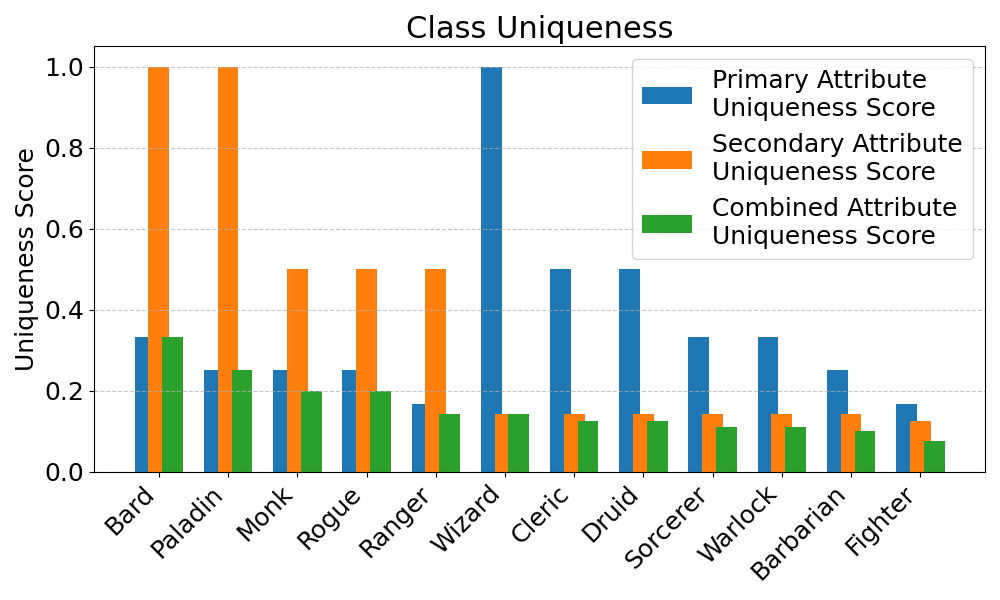{width=".73\\textwidth"}
:::

## Backgrounds

The distribution of backgrounds
(Fig [\[background\]](#background){reference-type="ref"
reference="background"}) across the simulation remains consistent, with
confidence intervals indicating a well-balanced representation of
different backgrounds. This suggests that the simulation does a good job
of capturing the variety of characters that can be generated across
different species and classes.\
Notably, certain class/background combinations stand out. For instance,
Rangers are under-represented with the Outlander background (the
suggested background in the PHB), while Wizards are disproportionately
associated with Guild Artisan and Entertainer backgrounds. The Charlatan
background, suggested for Rogues in the PHB, does not align well with
their preferred attributes, making this combination less common.
Conversely, Rogues are more often associated with the Urchin background,
suggesting a stronger connection between Dexterity and background skills
than originally anticipated.\
Other interesting findings include the tendency for Druids to come from
the Gladiator background, an anomaly given the lack of obvious synergy
between the class and the background. These inconsistencies reflect the
stochastic nature of the simulation, where randomness can lead to
surprising and often intriguing character builds.

# Alignments

Finally, the alignment distribution
(Fig [\[alignment\]](#alignment){reference-type="ref"
reference="alignment"}) reveals a strong preference for Lawful and Good
alignments, with Evil and Chaotic alignments less favored. This mirrors
the general perception of the \"average\" adventurer, who tends to be
more inclined toward order and moral righteousness. The alignment
distribution can be further explained by the fact that each failed
character generation process (i.e., a \"dead farmer\") adjusts alignment
weights toward more chaotic and evil alignments, though the initial bias
heavily favors Lawful and Good alignments.

# Conclusions and Future Work

This study explores the theoretical demographics of adventurers using
the rules and guidelines set forth in the 2014 Dungeons & Dragons
Player's Handbook (PHB). The simulation reveals several key patterns in
character creation, with Human Fighters emerging as the most common
demographic and Rock-Gnome Rogues as the rarest adventurers. Iconic
archetypes, such as the High-Elf Wizard, Half-Orc Barbarian, and
Tiefling Sorcerer, appear frequently, reflecting stereotypes deeply
rooted in D&D lore. Species representation in the adventuring population
follows an approximate population curve, where Humans and Elves are the
most prevalent and Gnomes and Dragonborn are the least common.\
A notable bias against Gnomes and Tieflings as adventurers is
identified, as these species receive limited species bonuses aligning
with class mechanics. Only Rock-Gnomes show any synergy, and even then,
it is restricted to a single class, Druid. This aligns with traditional
fantasy narratives where Gnomes are portrayed as rare and
nature-oriented but may also result from the simulation's weighting
mechanics, underscoring an area for potential re-balancing.\
The study highlights a balance between physical and mental classes and a
fine-tuned equilibrium between Strength-based and Dexterity-based
classes, with an equal number of classes favoring each. However,
significant disparities exist in attribute usage. Intelligence is
underutilized as a primary attribute, and spell-casting classes
consistently rely on Constitution to enhance survivability. This
reliance on Constitution may limit creative possibilities within
spell-casting archetypes, suggesting room for diversification in future
class designs.\
**Opportunities for Expansion**\
Several gaps in the attribute combination matrix provide a foundation
for expanding the character creation system. Some combinations remain
unexplored, such as those involving Constitution as a primary attribute
or mental attribute pairings like Intelligence and Wisdom. These
omissions reveal an opportunity for developing new classes or
archetypes. For instance, a Constitution-based primary class could
explore themes of resilience or life-force manipulation, offering a
darker or more unconventional character option.\
Additionally, Rogues could benefit from greater versatility,
incorporating Wisdom or Charisma as secondary attributes, which is
already supported in expansion content. Closing these gaps in the
attribute matrix
(Fig. [\[favored_attributes\]](#favored_attributes){reference-type="ref"
reference="favored_attributes"}) could foster innovation in gameplay and
character diversity.\
**Inclusion of New Content**\
The addition of species, classes, and backgrounds from post-2014
expansions represents an important direction for future work.
Incorporating new content into the simulation would create a more
inclusive and comprehensive demographic study, reflecting the diversity
of options now available to players.\
**Limitations and Future Data Collection**\
The analysis of real-world character creation trends remains challenging
due to limited data access. Platforms like D&D Beyond, a popular tool
for creating and managing characters, would be an ideal source for such
data. However, its lack of open access and restrictions on free content
introduce biases, limiting the scope of holistic demographic analyses.
Future research could explore collaborations with data custodians or
surveys of players to better understand how real-world preferences shape
the adventurer population.\
**Final Thoughts**\
This study provides a foundation for understanding adventurer
demographics, offering insights into the implicit biases and gaps within
the existing character creation framework. By identifying underutilized
mechanics and areas for expansion, this work invites the development of
new classes, species, and archetypes, enriching the creative potential
of Dungeons & Dragons. Integrating additional content and real-world
data would further refine the findings, creating a more dynamic and
inclusive portrait of the adventuring world.

# Code Availability

code is all publicly hosted at
https://github.com/simonhansedasi/char_gen

# Appendix

## Species Feat Weights {#species_feats}

::: {#speciesfeattable}
    **Feat ID** **Feat Name**            **Feat Weight**     **Feat ID** **Feat Name**             **Feat Weight**
  ------------- ------------------------ ----------------- ------------- ------------------------- -----------------
              1 Darkvision               6                             2 Superior Darkvision       8
              3 Dwarven Resilience       5                             4 Dwarven Combat Training   5
              5 Stonecunning             3                             6 Dwarven Toughness         6
              7 Dwarven Armor Training   3                             8 Skill Proficiency         2
              9 Resist Charm             5                            10 Trance                    5
             11 Drow Magic               5                            12 Drow Weapon Training      5
             13 Cantrip                  8                            14 Extra Language            3
             15 Fleet of Foot            5                            16 Mask of the Wild          5
             17 Elf Weapon Training      5                            18 Lucky                     6
             19 Brave                    5                            20 Nimbleness                5
             21 Naturally Stealthy       5                            22 Stout Resistance          5
             23 Feat                     10                           24 Draconic Ancestry         5
             25 Breath Weapon            5                            26 Damage Resistance         5
             27 Gnome Cunning            9                            28 Speak With Small Beasts   5
             29 Artificer's Lore         5                            30 Tool Proficiency          5
             31 Skill Proficiency + 1    3                            32 Menacing                  5
             33 Relentless Endurance     7                            34 Savage Attacks            6
             35 Hellish Resistance       5                            36 Infernal Legacy           7
             37 Sunlight Sensitivity     -5                                                        

  : Player's Handbook species starting feats with subjective weights
  used for species selection.
:::

## Alignment Weights {#alignment_weights}

::: {#alignmentweighttable}
  **Alignment**   **Weight**       **Alignment** **Weight**
  --------------- ------------ ----------------- ------------
  Lawful Good     100               Neutral Good 90
  Chaotic Good    80              Lawful Neutral 70
  True Neutral    40             Chaotic Neutral 55
  Lawful Evil     14                Neutral Evil 15
  Chaotic Evil    13                             

  : Initial weights for a random choice function to select alignment.
  Each failure to create a character or "dead farmer" nudges alignment
  weights to favor chaotic and evil alignments.
:::